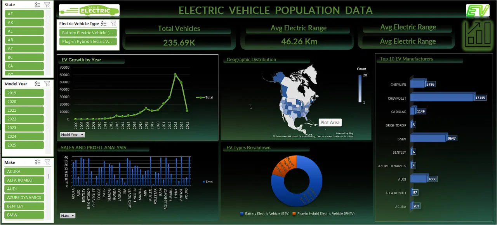

<div align="center">


<br/>


<br/>

> **Real-world EV registration data → cleaned, analyzed, and visualized entirely in Microsoft Excel with an interactive dashboard, pivot charts, and slicers.**

<br/>

[](https://catalog.data.gov/dataset/electric-vehicle-population-data)
[](https://anandsavarn.vercel.app)
[](https://github.com/Anandsavrarn)

</div>

---

## 📸 Dashboard Preview

<div align="center">


> *Interactive Excel dashboard showing EV growth trends, geographic distribution, top manufacturers, BEV vs PHEV breakdown, and sales analysis — all built with Pivot Tables, Slicers, and Dynamic Charts.*
</div>

---

## 📘 What Is This Project?

This project takes a **real US government dataset** of 235,000+ registered Electric Vehicles and analyses it entirely using **Microsoft Excel** — no Python, no Power BI, no coding required.

Using only Excel's built-in tools — Pivot Tables, Charts, Slicers, COUNTIFS, IF formulas, and Conditional Formatting — the project builds a **fully interactive dashboard** that answers key questions about EV adoption trends across states, manufacturers, and years.

This project is ideal for anyone learning **data analysis with Excel** and wanting to see how far Excel can go on a real-world dataset.

---

## 📁 Dataset Information

| Property | Detail |
|---|---|
| **Source** | [catalog.data.gov — Electric Vehicle Population Data](https://catalog.data.gov/dataset/electric-vehicle-population-data) |
| **Provided By** | Washington State Department of Licensing |
| **Format** | CSV → Imported into Excel |
| **Total Records** | 235,690+ EV registrations |
| **Geography** | United States (all states) |

### 📋 Columns in the Dataset

| Column Name | Description |
|---|---|
| VIN | Unique vehicle identifier |
| County | County of registration |
| City | City of registration |
| State | US State code (e.g., WA, CA) |
| Postal Code | ZIP code |
| Model Year | Year the vehicle was manufactured |
| Make | Manufacturer (Tesla, Chevrolet, BMW…) |
| Model | Specific vehicle model |
| Electric Vehicle Type | BEV (Battery) or PHEV (Plug-in Hybrid) |
| Electric Range | Maximum range in km/miles on electric charge |
| Base MSRP | Manufacturer's suggested retail price |
| Legislative District | Political district for policy analysis |
| Vehicle Location | Geographic coordinates |

---

## 🔄 Step-by-Step: What Was Done

### 🧹 Step 1 — Data Cleaning

Before any analysis, the raw CSV data was cleaned inside Excel:

```
✅ Removed duplicate VIN entries
✅ Handled blank/missing Electric Range values (replaced with 0 or average)
✅ Standardized State column (removed extra spaces, uppercase)
✅ Converted Model Year column to Number format
✅ Fixed date/text formatting inconsistencies
✅ Renamed columns for readability
✅ Removed irrelevant columns not needed for analysis
✅ Applied filters to check for outliers in Electric Range
```

### 📐 Step 2 — Data Categorization

New helper columns were added to make analysis easier:

| New Column | Formula Used | Purpose |
|---|---|---|
| EV Category | `=IF(H2="BEV","Battery Electric","Plug-in Hybrid")` | Label vehicle type clearly |
| Year Group | `=IF(F2>=2020,"2020+",IF(F2>=2017,"2017-2019","Pre-2017"))` | Group by adoption era |
| Range Tier | `=IF(G2>200,"Long Range",IF(G2>100,"Mid Range","Short Range"))` | Classify by electric range |

---

### 📊 Step 3 — Pivot Table Analysis

Five Pivot Tables were created, each answering a specific business question:

**Pivot Table 1 — EV Growth by Year**
```
Rows:    Model Year
Values:  Count of VIN
Result:  Year-by-year registration count showing the adoption curve
```

**Pivot Table 2 — Top EV Manufacturers**
```
Rows:    Make
Values:  Count of VIN
Sort:    Descending by count
Result:  Ranked list of manufacturers by total registrations
```

**Pivot Table 3 — BEV vs PHEV Breakdown**
```
Rows:    Electric Vehicle Type
Values:  Count of VIN, % of Total
Result:  Share of Battery Electric vs Plug-in Hybrid vehicles
```

**Pivot Table 4 — State-wise Distribution**
```
Rows:    State
Values:  Count of VIN
Result:  Which states have highest EV adoption
```

**Pivot Table 5 — Average Electric Range by Year**
```
Rows:    Model Year
Values:  Average of Electric Range
Result:  How electric range has improved over time
```

---

### 📈 Step 4 — Charts & Visualizations

| Chart | Type | What It Shows |
|---|---|---|
| EV Growth by Year | Line Chart | Adoption curve from 2000–2025 |
| Top 10 Manufacturers | Horizontal Bar | Chevrolet, BMW, Tesla, Audi rankings |
| BEV vs PHEV | Donut Chart | ~80% BEV vs ~20% PHEV split |
| Sales by Make | Column Chart | Volume comparison across all brands |
| Geographic Distribution | Filled Map | State-level EV density across the US |

All charts are **linked to Pivot Tables** — they update automatically when slicers are used.

---

### 🎛️ Step 5 — Interactive Dashboard

The final dashboard sheet combines everything with:

```
📌 3 KPI Cards   →  Total Vehicles | Avg Electric Range | Top State
🎚️ 3 Slicers    →  State | Model Year | EV Type (BEV/PHEV)
📊 5 Charts      →  All linked and filterable
🎨 Color Coding  →  Green theme matching EV/sustainability aesthetic
```

**How slicers work:**
Click any button on the slicer → all charts and KPI cards update instantly to show only the filtered data.

Example:
- Select **State = CA** → see only California's EV data
- Select **Year = 2022, 2023** → see only recent registrations
- Select **Type = BEV** → remove PHEVs from all charts

---

## 📌 Key Insights From the Analysis

> 💡 **Adoption Explosion Post-2017** — Over 80% of all registered EVs are 2017 or newer models, showing the impact of Tesla's Model 3 launch and government EV incentives.

> 💡 **Chevrolet Leads at 17,135** — Among non-Tesla brands in the dataset, Chevrolet (Bolt EV) dominates with the highest registration count.

> 💡 **Washington State Dominates** — The dataset is heavily concentrated in WA state, reflecting the data provider (WA Dept. of Licensing), but CA and FL follow closely.

> 💡 **BEV vs PHEV = 80:20** — Consumers strongly prefer fully electric vehicles over plug-in hybrids, showing confidence in EV range and charging infrastructure.

> 💡 **Range Improving Every Year** — Average electric range per vehicle has consistently increased from ~50 km in 2013 models to 200+ km in 2022+ models.

> 💡 **Premium Brands = Higher Range** — BMW, Audi, and Chevrolet (Bolt) consistently outperform budget brands in electric range metrics.

---

## 🏆 Excel Features Used — Full List

```
✔ Data Import from CSV
✔ Remove Duplicates (Data tab)
✔ Text to Columns
✔ Find & Replace for standardization
✔ Filters and Custom Sort
✔ IF, COUNTIFS, SUMIFS, AVERAGEIFS formulas
✔ Pivot Tables (5 separate tables)
✔ Pivot Charts (auto-linked to tables)
✔ Slicers (connected across multiple pivots)
✔ Conditional Formatting (color scales, icon sets)
✔ Data Validation & Drop-down Lists
✔ Named Ranges
✔ Filled Map Chart (geographic view)
✔ Dashboard layout with sheet organization
✔ Freeze Panes & Print Area setup
```

---

## 🧠 Skills Demonstrated

```
✔ Real-world data cleaning & preprocessing in Excel
✔ Building structured Pivot Table analysis framework
✔ Creating a professional interactive dashboard with slicers
✔ Deriving actionable business insights from raw data
✔ Geographic data visualization using Excel Maps
✔ Data storytelling — turning numbers into readable insights
✔ Formula-driven data categorization (IF, COUNTIFS, AVERAGEIFS)
✔ Dashboard UI/UX design principles within Excel
```

---

## 🔮 Future Scope

- [ ] 🐍 Rebuild analysis in Python (Pandas + Plotly) for comparison
- [ ] 📊 Migrate dashboard to Power BI for web-publishing
- [ ] 🗺️ Add county-level map drill-down
- [ ] 🔔 Add alert system — highlight states with <100 EV registrations
- [ ] 📈 Add forecasting using Excel's FORECAST.ETS function
- [ ] 🌍 Expand to include EU and India EV registration datasets

---

## 📁 Repository Structure

```
📦 Electric-Vehicle-Population-Data-Excel
 ┣ 📊 EV_Population_Analysis.xlsx     ← Main Excel file (dashboard + pivots)
 ┣ 📋 electric_vehicle_data.csv       ← Raw dataset from data.gov
 ┣ 📄 README.md                       ← Project documentation (this file)
 ┗ 📁 assets/
    ┗ 🖼️ ev-dashboard-preview.png     ← Dashboard screenshot
```

---

## 🚀 How to Use This Project

```
1. Download the repository (Code → Download ZIP)
2. Open EV_Population_Analysis.xlsx in Microsoft Excel 2016 or later
3. Go to the "Dashboard" sheet
4. Use the slicers on the left to filter by:
      → State (AE, AK, AL, CA, WA...)
      → Model Year (2019, 2020, 2021, 2022, 2023, 2024, 2025)
      → EV Type (Battery Electric / Plug-in Hybrid)
5. All charts and KPI cards update automatically
6. To explore raw data → go to "Raw Data" sheet
7. To see pivot logic → go to "Pivot Tables" sheet
```

> ⚠️ **Note:** If charts don't appear, enable editing and enable content when prompted by Excel. The file uses standard Excel features only — no macros required.

---

## 📖 References

| Resource | Link |
|---|---|
| Dataset Source | [data.gov — EV Population Data](https://catalog.data.gov/dataset/electric-vehicle-population-data) |
| Washington State DOL | [data.wa.gov](https://data.wa.gov/) |
| Excel Pivot Table Guide | [Microsoft Support](https://support.microsoft.com/en-us/office/create-a-pivottable-to-analyze-worksheet-data-a9a84538-bfe9-40a9-a8e9-f99134456576) |
| IEA EV Outlook 2024 | [iea.org](https://www.iea.org/reports/global-ev-outlook-2024) |

---

<div align="center">

### 👨‍💻 Author

**Anand Kumar**
B.Tech – Computer Science Engineering (Data Science)
Lovely Professional University, Punjab

<br/>

[](https://anandsavarn.vercel.app)
[](https://github.com/Anandsavarn)
[](https://www.linkedin.com/in/)

<br/>

---

*⭐ If this project helped you learn Excel data analysis, please star the repo — it helps others find it!*


</div>
